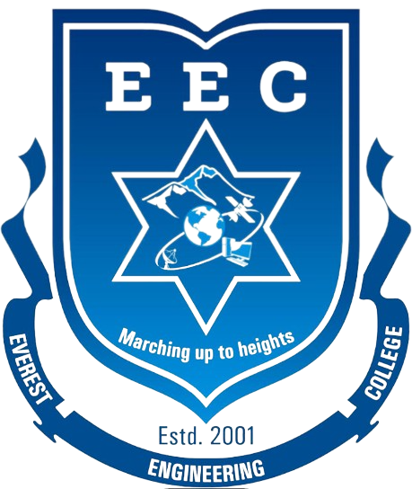

Currently, I am actively seeking for Ph.D. opportunities. 

### Bachelor in Information Technology Engineering (2018 - 2023)

  
   Everest Engineering College, Pokhara University, Nepal

* Major Courses : C/C++, Programming in Java, Microprocessor, Web Technology, Cloud Computing, Data Mining

### High Level School ( 10 +2), Science (2016 - 2018) 

  
   Kathmandu Bernhardt, Nepal

### School Leaving Certificate (SLC)  

  
  Sakura Memorial Boarding School, Nepal 

 
